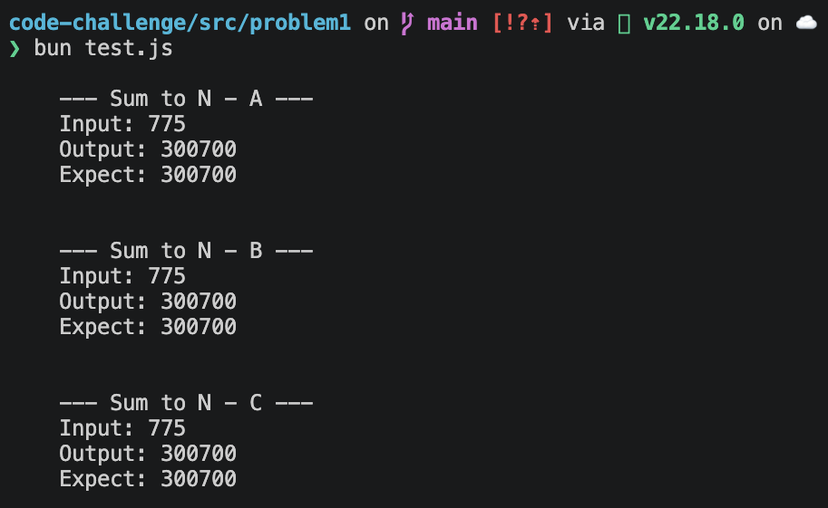

# 99Tech Code Challenge #1

## Problem 1: Three ways to sum to n

- The [answer file](src/problem1/index.js)
- The [test file](src/problem1/test.js)
- Terminal log:
  

## Problem 2: Fancy Form

- Product site [Fancy Form](https://code-challenge-eight-mocha.vercel.app/)
- [Source code](src/problem2/fancy-form) using Vite + React for lite fast demo

- Preview:
  

## Problem 3: Messy React

- Problem files: [Messy React](src/problem3/problem.tsx)
- Fixed: [Optimized File](src/problem3/fixed.tsx)
- Explaination: [Docs](src/problem3/explaination.md)
